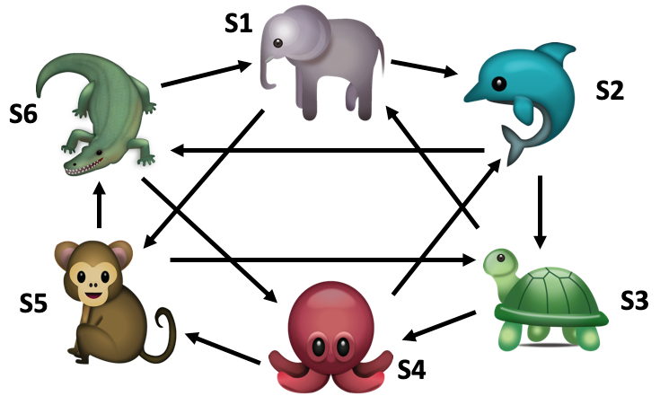
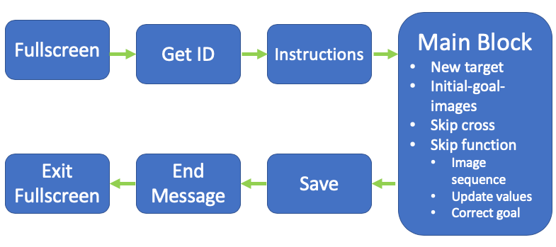
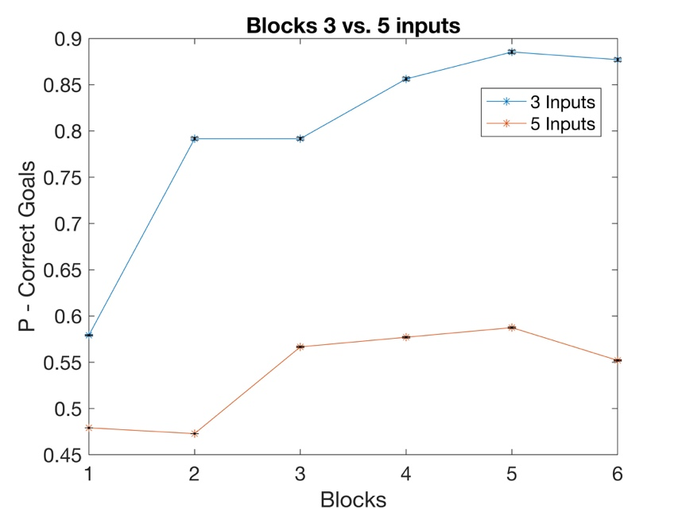
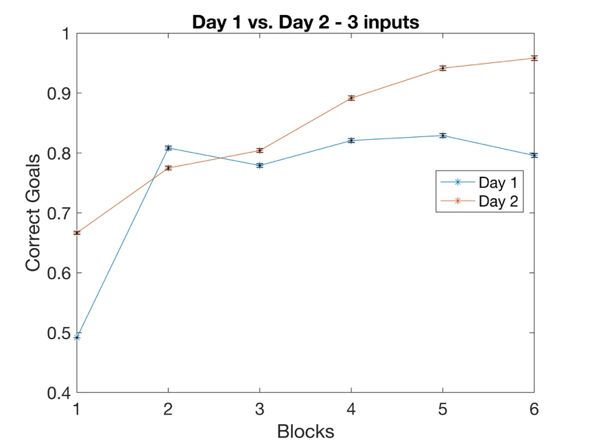
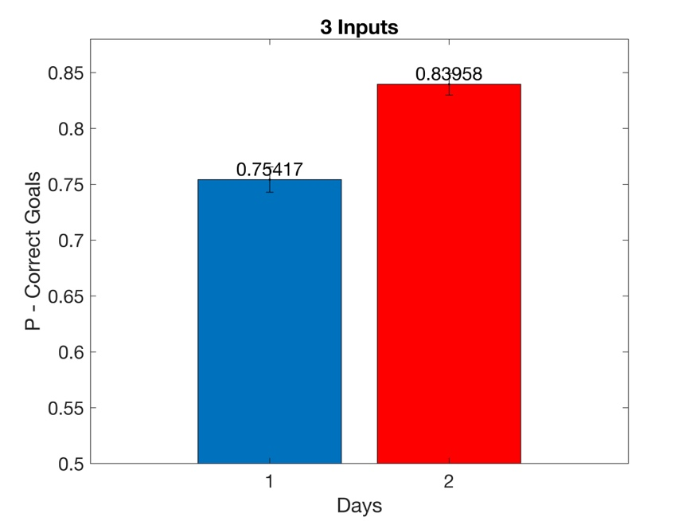
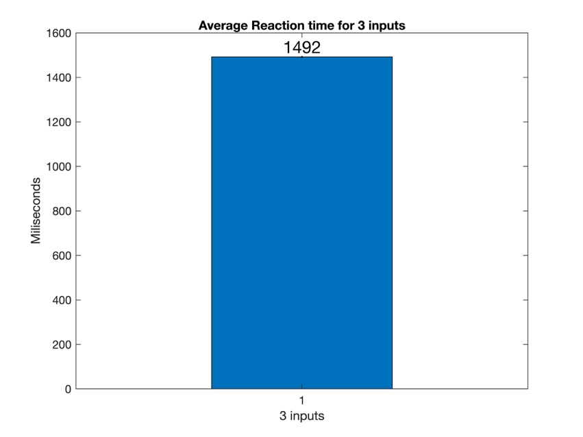
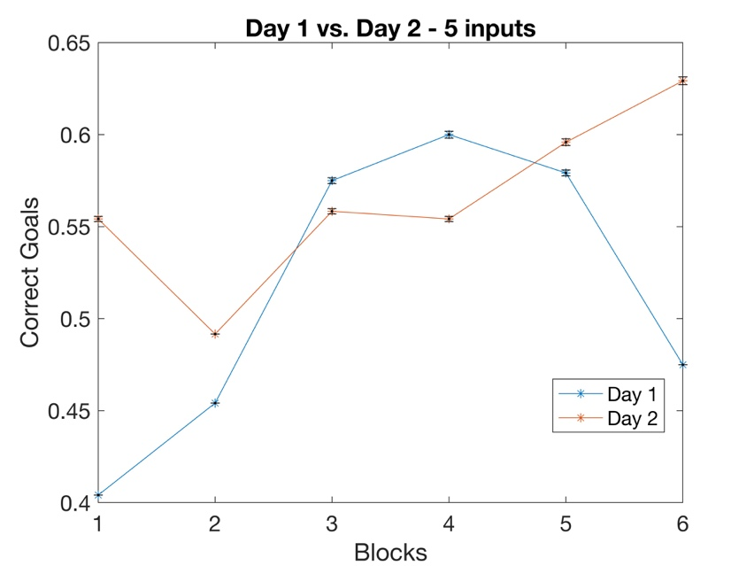
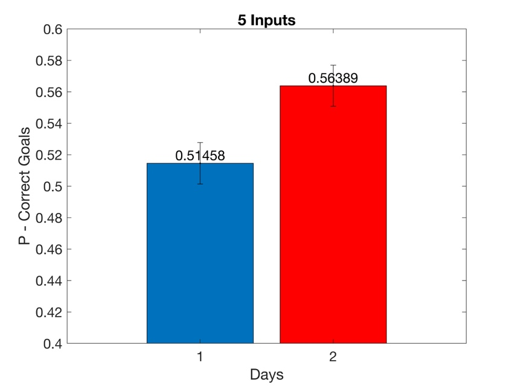
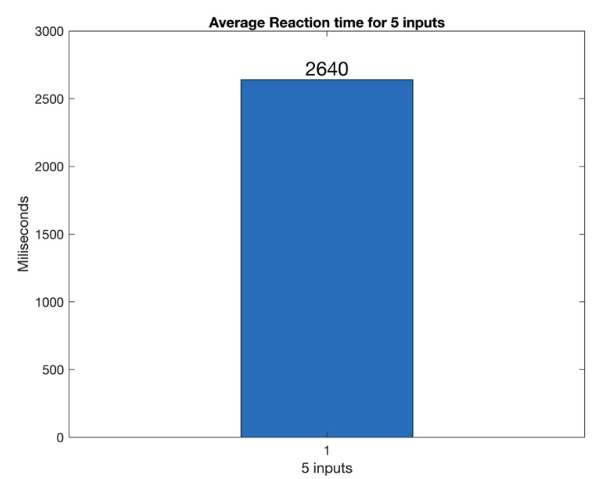

# Cognitive Path Planning and Memory Task (Research Project)

The project aimed to design, test, and analyze a cognitive task inspired by [Kurth-Nelson et al., 2016](http://dx.doi.org/10.1016/j.neuron.2016.05.028), exploring **path planning** and **memory** through a trial-based paradigm.

---

## Academic Context

This project was carried out as part of my **Master’s degree in Medical Systems Engineering** at **Otto von Guericke University Magdeburg**. The research track counted for **20 credit points** of the program and was completed under the supervision of [**Prof. Dr. Jochen Braun**](https://www.ovgu.de/Braun_J.html).  

I was personally responsible for the **full development of the experimental code**: while the study was built on the **jsPsych** library framework, I designed and implemented the trial logic, state connectivity, and experimental sequence independently.  

The project was evaluated with the grade **1.0 (the highest grade in the German grading system)**.  

---

## Project Objective
The experiment evaluated **path planning and memory performance** by measuring:
- **Success rate** (correct target reached)  
- **Reaction time** (time to plan, select, and execute moves)  

The task was implemented in **JavaScript** using the [jsPsych](https://www.jspsych.org) library, enabling browser-based experiments without the need for additional software.

---

## Experiment Design
- Participants navigated between **6 states** represented by images (e.g., food, animals).  
- Each trial started at a random state and required reaching a target in **3 or 5 steps**.  
- Inputs were given via keyboard keys (**F** and **J**) and confirmed with the **Spacebar**.  
- Success was rewarded with a ✅ green tick; errors or timeouts (5s limit) with a ❌ red cross.  
- Each participant completed **6 blocks of 60 trials per session** (two sessions total).  

   
  <em>Diagram of state connections.</em>

---

## Methods
- **Participants:** 8 (ages 23–33), split into two groups (different order of 3 vs 5-step trials).  
- **Stimuli:** 9 sets of semantic-field images (animals, food, etc.).  
- **Logic:** Navigation determined by a **Connectivity Matrix (CM)** linking states to inputs.  
- **Development:** Built with **jsPsych** + custom plugins for key handling, matrix multiplication, and random target generation.  

   
  <em>Table 1. Elements of the main script.</em>

---

## Results
- **Correct responses:**  
  - 3-step trials: ~79% success (above chance).  
  - 5-step trials: ~53% success (lower performance).  
- **Reaction times:**  
  - 3-step trials: ~1492 ms average.  
  - 5-step trials: ~2640 ms average.  
- Performance improved across blocks, especially on the second day (learning effect).  

   
  <em>Accuracy comparison between 3-step and 5-step trials.</em>

   
  <em>Learning effect across two sessions for 3 inputs.</em>

   
  <em>Response rate across two session for 3 inputs</em>

   
  <em>Reaction time distributions for 3 inputs</em>

   
  <em>Learning effect across two sessions for 5 inputs</em>

   
  <em>Response rate across two session for 5 inputs</em>

   
  <em>Reaction time distributions for 5 inputs</em>

---

## Key Findings
- Participants improved over time, with faster responses and higher accuracy on the second day.  
- Performance decreased in longer (5-step) trials, suggesting **increased cognitive load**.  
- Results differed from Kurth-Nelson et al. (2016), potentially due to fewer training sessions in this study.  
- The experiment demonstrates the feasibility of browser-based cognitive testing for memory and planning.  

---

## Tech Stack
- **JavaScript** (core implementation)  
- **[jsPsych](https://www.jspsych.org)** (experiment framework)  
- **Custom plugins** for key handling and state navigation logic  

---

## References
- Kurth-Nelson et al. (2016). *Fast Sequences of Non-spatial State Representations in Humans*. Neuron 91, 194–204. [DOI](http://dx.doi.org/10.1016/j.neuron.2016.05.028)  
- de Leeuw, J. (2019). *jsPsych: A JavaScript library for creating behavioral experiments in a Web browser*. [Website](https://www.jspsych.org)  

---

## Acknowledgements
Special thanks to **PhD student Ehsan Kakaei** for guidance during the development of this project.  

---

## Any questions, comments or suggestions can be directed to:

Igor Tellez [igor.tellez@gmail.com](mailto:igor.tellez@gmail.com)
